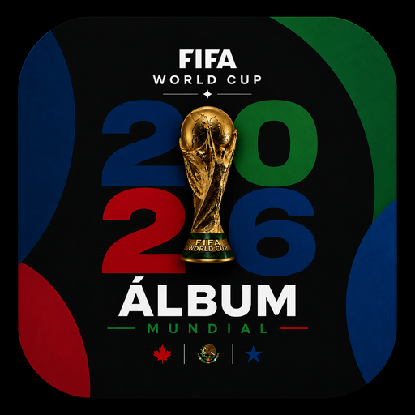

<p align="center">
  
</p>

<h1 align="center">🏆 Álbum Mundial 2026</h1>

<p align="center">
  <em>Tu álbum digital de láminas del FIFA World Cup 2026</em>
</p>

<p align="center">
  
  
  
  
  
</p>

<br>

Una **Progressive Web App (PWA)** para llevar el seguimiento de tu colección de láminas del álbum oficial del FIFA World Cup 2026. Sin frameworks, sin servidor, sin instalación — solo abre y colecciona.

---

## ✨ Funcionalidades

- **📖 Álbum completo** — Organizado por secciones (países, FIFA World Cup, sección especial Coca-Cola). Cada sección muestra la bandera, contador de progreso y una barra de avance individual.
- **🏷 Registro de láminas** — Marca cada lámina como obtenida o faltante, y lleva la cuenta de las repetidas con controles + / −.
- **🔍 Búsqueda inteligente** — Busca por nombre de país, prefijo (`BRA`) o código exacto (`ARG7`). Si el código existe, navega automáticamente a la sección y resalta la lámina con un efecto de brillo.
- **📊 Estadísticas detalladas** — Porcentaje de completitud global, secciones completas / iniciadas / vacías, y las secciones más y menos avanzadas.
- **🔄 Panel de intercambios** — Lista de repetidas (ordenadas de mayor a menor) y lista compacta de faltantes para facilitar los cambios con otros coleccionistas.
- **💾 Exportar / Importar** — Guarda tu colección en un archivo `.json` y recupérala en cualquier momento o dispositivo.
- **📱 Instalable como app** — Al ser una PWA con Service Worker, se puede instalar en el celular y funciona sin conexión a internet.

---

## 📋 Secciones del álbum

El álbum cubre **50 secciones** con las selecciones participantes del Mundial 2026:

| Sección | Prefijo | Láminas |
|---|---|---|
| FIFA World Cup | `FWC` | 20 |
| 48 selecciones nacionales | `MEX`, `BRA`, `ARG`, `FRA`… | 20 c/u |
| Coca-Cola Especial | `CC` | 14 |

> 📌 **Total aproximado: 974 láminas**

---

## 🚀 Uso

Por ser una aplicación completamente del lado del cliente, no requiere instalación ni servidor:

1. Clona el repositorio:
   ```bash
   git clone https://github.com/g4lvan/laminas.git
   ```
2. Abre `index.html` directamente en el navegador.

O accede a la versión publicada si está desplegada en GitHub Pages.

## 📱 Instalar como PWA

En Chrome (Android o escritorio):

> Abre el sitio → menú del navegador → **"Agregar a pantalla de inicio"** o **"Instalar app"**

La app quedará disponible offline gracias al Service Worker.

---

## 💾 Almacenamiento de datos

El progreso se guarda localmente en el navegador con `localStorage`. Para no perder los datos al cambiar de dispositivo o limpiar el navegador, usa la función **Exportar** en la pestaña de Estadísticas. Luego podés restaurarlo con **Importar**.

---

## 🗂 Estructura del proyecto

```
laminas/
├── index.html        # Aplicación completa (HTML + CSS + JS)
├── manifest.json     # Configuración de la PWA
├── sw.js             # Service Worker (modo offline)
├── icon-192-v2.png   # Icono de la app (192×192)
└── icon-512-v2.png   # Icono de la app (512×512)
```

---

## 🛠 Tecnologías

- **HTML5, CSS3 y JavaScript vanilla** — sin frameworks ni dependencias externas.
- **PWA** con Service Worker y Web App Manifest.
- **Banderas** renderizadas vía [flagcdn.com](https://flagcdn.com).

---

## 📄 Licencia

Proyecto de uso personal. Los nombres, escudos y marcas relacionadas con FIFA y el FIFA World Cup 2026 son propiedad de sus respectivos dueños.
